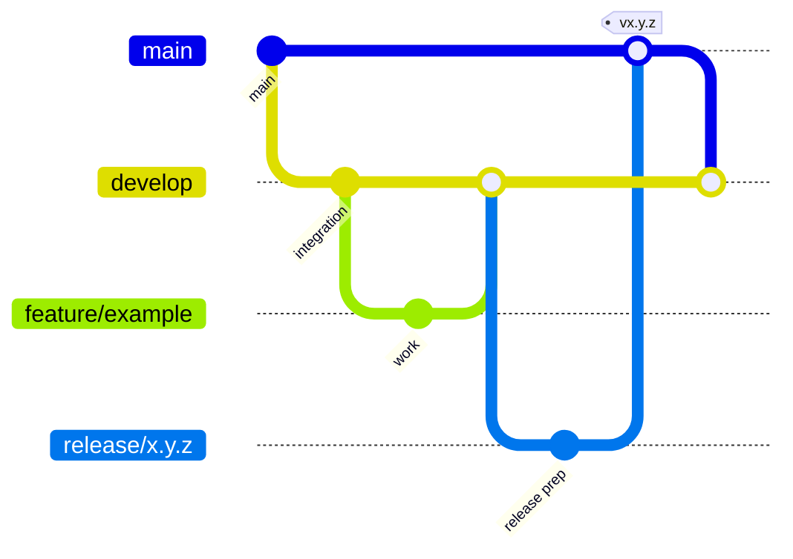

# Contributing

Thanks for your interest in Serial Joystick Keymapper.

## Development model

This repository uses a lightweight GitFlow workflow.



Use:

- `main` for released and stable states.
- `develop` for integrated development.
- `feature/<name>` for normal development work.
- `fix/<name>` for non-release fixes.
- `release/<version>` for release preparation.
- `hotfix/<name>` only for urgent fixes based on `main`.

## Local setup

The desktop application requires Python 3.11 or newer and targets Windows.

```powershell
cd desktop_app
py -3.11 -m venv .venv
.venv\Scripts\activate
python -m pip install -r requirements.txt
python main.py
```

For development tests:

```powershell
python -m pip install pytest
$env:PYTHONPATH = "."
python -m pytest tests
```

## Pull requests

Keep pull requests focused and small enough to review.

A pull request should include:

- a concise description of the problem and solution
- tests when pure logic changes
- documentation updates when behavior or interfaces change
- no generated files, local profiles or environment-specific configuration

## Commit style

Prefer short conventional-style messages:

```text
feat: add reconnect strategy
fix: release held keys on disconnect
test: cover invalid serial frames
docs: document calibration pipeline
```

## Hardware changes

Changes to firmware or pin assignments should also update the relevant hardware and protocol documentation.
