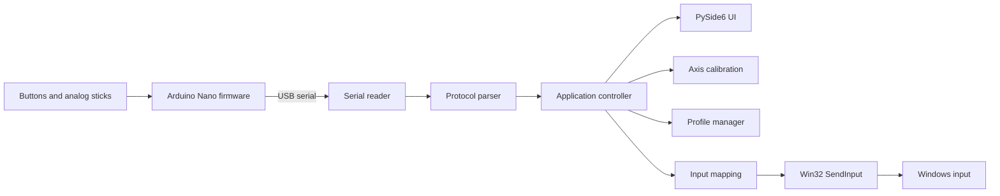

# Serial Joystick Keymapper

Arduino Nano firmware and a Windows desktop application to read a custom-wired joystick over serial and map its buttons and analog sticks to keyboard and mouse input.


## Overview

This project bridges a custom joystick wired to an **Arduino Nano** with a **Windows desktop application**.

The Arduino reads:

- 4 digital buttons
- 2 analog sticks
- 4 analog axes in total

The desktop application receives the raw state over USB serial and provides:

- live input monitoring
- per-axis calibration
- configurable keyboard and mouse mappings
- JSON-based profiles
- system tray operation
- a global mapping enable switch
- a panic stop to immediately release synthetic inputs

## Architecture

The project deliberately keeps the hardware side simple and moves calibration and mapping logic to the desktop application.



See [docs/architecture.md](docs/architecture.md) for the detailed component view and design decisions.

## Features

### Firmware

- Reads 4 digital buttons
- Reads 4 analog channels
- Sends joystick state over serial
- Keeps hardware logic intentionally small
- Uses a human-readable transport format for easier debugging

### Desktop application

- Live button and stick monitoring
- Serial port and baud-rate configuration
- Per-axis calibration:
  - minimum
  - center
  - maximum
  - deadzone
  - inversion
  - sensitivity
  - expo
  - thresholds
  - hysteresis
- Button mapping:
  - keyboard press
  - keyboard hold
  - mouse buttons
- Axis mapping:
  - digital key thresholds
  - mouse movement
- JSON profile save and load
- Mapping enable and disable control
- Panic stop
- Windows input injection through Win32 `SendInput`

## Project structure

```text
serial-joystick-keymapper/
|-- .github/
|   `-- workflows/
|       `-- ci.yml
|-- desktop_app/
|   |-- app/
|   |   |-- core/
|   |   |-- mapping/
|   |   |-- profiles/
|   |   |-- serial/
|   |   `-- ui/
|   |-- profiles/
|   |-- tests/
|   |-- main.py
|   |-- pyproject.toml
|   `-- requirements.txt
|-- docs/
|   |-- architecture.md
|   |-- calibration.md
|   |-- protocol.md
|   `-- roadmap.md
|-- firmware/
|   `-- nano_serial_joystick/
|       `-- nano_serial_joystick.ino
|-- CHANGELOG.md
|-- CONTRIBUTING.md
|-- LICENSE
`-- README.md
```

## Serial protocol

The firmware sends newline-delimited text frames:

```text
T,<b1>,<b2>,<b3>,<b4>,<s1x>,<s1y>,<s2x>,<s2y>
```

Example:

```text
T,0,1,0,0,512,498,1023,14
```

Where:

- `b1..b4` are button states
- `s1x, s1y, s2x, s2y` are raw ADC values

See [docs/protocol.md](docs/protocol.md) for details.

## Requirements

- Windows 11
- Python 3.11 or newer
- Arduino Nano
- USB serial connection

## Installation

### 1. Flash the firmware

Upload:

```text
firmware/nano_serial_joystick/nano_serial_joystick.ino
```

to the Arduino Nano.

### 2. Create the Python environment

```powershell
cd desktop_app
py -3.11 -m venv .venv
.venv\Scripts\activate
python -m pip install -r requirements.txt
```

### 3. Run the application

```powershell
python main.py
```

## Tests

The repository includes automated tests for the platform-independent logic:

- serial frame parsing
- axis normalization
- threshold and hysteresis behavior
- profile serialization and deserialization

Run them with:

```powershell
cd desktop_app
python -m pip install pytest
$env:PYTHONPATH = "."
python -m pytest tests -q
```

GitHub Actions runs the same validation on Windows for pull requests and pushes to `main` and `develop`.

## Safety

This application can generate real keyboard and mouse events.

Recommended safeguards:

- start with mappings disabled
- calibrate the joystick before enabling input mapping
- use harmless test bindings first
- use the panic stop if synthetic input behaves unexpectedly

## Current limitations

- Windows-only desktop input backend
- Requires the desktop application to be running
- The Arduino is used as a serial device rather than as a native USB HID joystick
- Some applications or games may treat synthetic keyboard and mouse events differently

## Roadmap

See [docs/roadmap.md](docs/roadmap.md).

The next improvements are focused on diagnostics, reconnect behavior, packaging and distribution.

## Contributing

Development workflow and contribution guidelines are documented in [CONTRIBUTING.md](CONTRIBUTING.md).

## License

Released under the MIT License. See [LICENSE](LICENSE).
