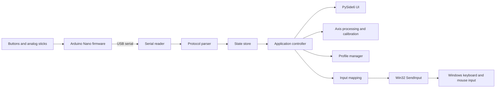
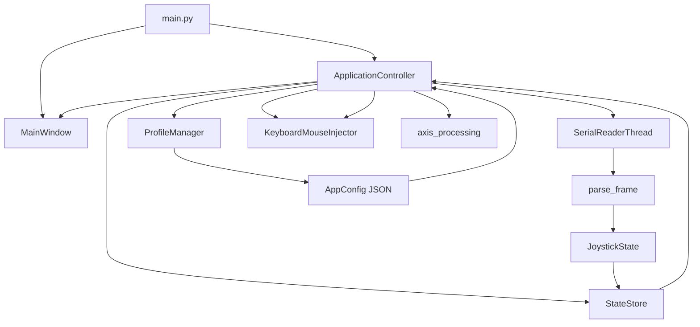

# Architecture

## System context

The project is split into two execution environments:

- Arduino Nano firmware reads the physical joystick.
- The Windows desktop application receives serial frames, calibrates the signals and maps them to keyboard and mouse events.



## Desktop application



## Responsibilities

### Firmware

The Arduino firmware owns physical input acquisition. It reads four digital buttons and four analog axes and publishes a simple text frame over USB serial.

### Serial layer

`SerialReaderThread` owns the serial connection and runs outside the UI thread. Each line is passed to `parse_frame`, which converts the transport representation into a `JoystickState`.

### Core layer

`ApplicationController` coordinates connection state, profiles, input processing, UI-facing signals and output injection.

`StateStore` keeps the latest application configuration and joystick state.

### Mapping layer

`axis_processing.py` converts raw ADC values into normalized values and digital axis states. Calibration includes center, limits, deadzone, inversion, sensitivity, expo, thresholds and hysteresis.

`KeyboardMouseInjector` converts configured actions into Windows input events through the Win32 `SendInput` API.

### Profiles

Profiles are JSON files serialized from `AppConfig`. They contain serial settings, button mappings and per-axis calibration and mapping parameters.

## Serial protocol

The current protocol is intentionally simple:

```text
T,<b1>,<b2>,<b3>,<b4>,<s1x>,<s1y>,<s2x>,<s2y>
```

Example:

```text
T,0,1,0,0,512,498,1023,14
```

See [protocol.md](protocol.md) for the field definition.

## Design choices

- Human-readable serial protocol for easy diagnostics.
- Hardware kept simple; calibration and mapping live on the desktop.
- UI and serial acquisition are separated so the UI thread is not blocked.
- Input injection is isolated behind a dedicated class.
- Profiles use JSON so they are easy to inspect and version.
- A visible mapping enable switch and panic stop reduce the risk of unwanted synthetic input.

## Current platform boundary

The desktop application is intentionally Windows-specific because input injection currently uses Win32 `SendInput`. The protocol, models, profile schema and axis processing are mostly platform-independent and can be reused if another input backend is added later.
